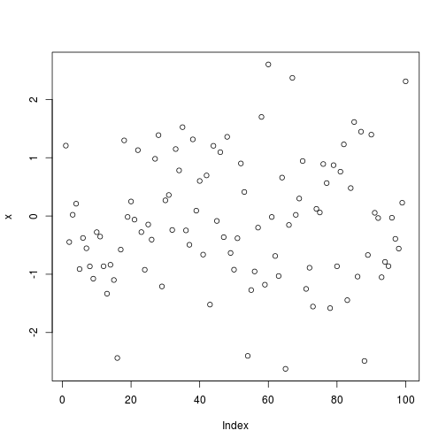
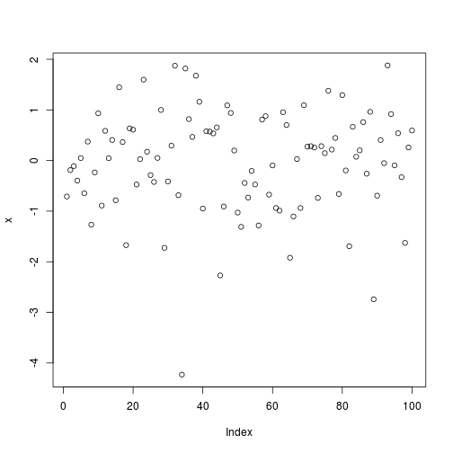
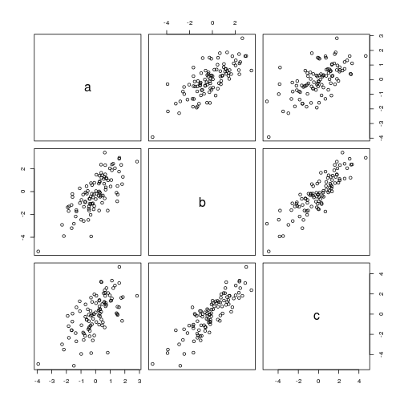
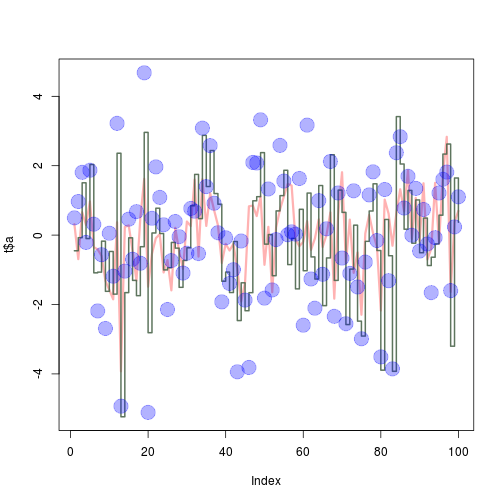
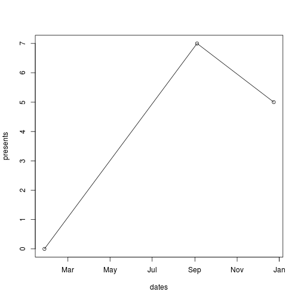

In this assignment I am starting to practice R language.

I will do a few exercises to get a hang of it.

Github username: alopyrev

Link to the exercise source:

https://cran.r-project.org/doc/contrib/Torfs+Brauer-Short-R-Intro.pdf

#3. Some first exapmles of R


3.1 Calculator

```r
(2016-2014)/(2016-1992)*100
```

```
## [1] 8.333333
```

3.2 Workspace


```r
a = 2016

b = 2014

c = 1992

(a-b)/(a-c)*100
```

```
## [1] 8.333333
```

3.4 Functions


```r
sum(c(4,5,8,11))
```

```
## [1] 28
```

3.5 Plots


```r
x = rnorm(100)

plot(x);
```




#4 HELP


```r
?sqrt
```

#5 Scripts
Made a file call "scripts_to_do.R"

```r
source("/home/alex/Desktop/Short_Intro_to_R/#5_Scripts_To_do.R")
```




#6 Vectors

6.2 Matrix+Vector


```r
P = seq(31,60)

Q = matrix(P, ncol=5, nrow=6 )

Q
```

```
##      [,1] [,2] [,3] [,4] [,5]
## [1,]   31   37   43   49   55
## [2,]   32   38   44   50   56
## [3,]   33   39   45   51   57
## [4,]   34   40   46   52   58
## [5,]   35   41   47   53   59
## [6,]   36   42   48   54   60
```

6.3 Data Frames


```r
x1= rnorm(100)
x2= rnorm(100)
x3= rnorm(100)


t= data.frame(a= x1, b = (x1+x2),c = (x1+x2+x3))

t
```

```
##                a           b            c
## 1    0.314872561 -0.45078355  0.498703646
## 2   -0.691629407 -0.07357901  0.969003989
## 3    0.659495780  1.50732606  1.809998734
## 4    0.292982552 -0.09919750 -0.210155703
## 5    0.972392377  2.03499253  1.869524448
## 6   -0.344932815 -1.08695753  0.315302649
## 7   -0.410252327 -1.06686224 -2.184273796
## 8   -0.597212569 -0.17437260 -0.562726555
## 9   -1.319584786 -1.61996200 -2.689175104
## 10  -1.579857094 -0.47151630  0.054161503
## 11  -1.848466690 -1.70105365 -1.183361676
## 12   0.370510025  2.36008916  3.221998626
## 13  -3.925123689 -5.23567990 -4.930328413
## 14   0.238550091 -1.65745662 -1.037009318
## 15   0.279993137 -0.07805186  0.459066055
## 16  -0.459034649 -1.30461646 -0.695083503
## 17  -1.310325001 -1.74557171  0.678154209
## 18   0.497925648 -0.33435606 -0.811252680
## 19   1.623073749  2.96113198  4.679091608
## 20  -1.485094793 -2.81242524 -5.109345614
## 21  -0.535750866  0.06179159  0.485168225
## 22  -0.087489941  0.77587403  1.968198000
## 23   0.026583272  0.04622441  1.087988371
## 24  -1.074933044 -1.00310695  0.298786108
## 25  -0.719529689 -0.94091565 -2.143240075
## 26  -1.590974100 -0.21127942 -0.733784666
## 27   0.211469624 -0.37569714  0.393400106
## 28  -0.466635339 -1.50470556 -0.044135660
## 29  -0.970924997 -0.73076025 -1.092967953
## 30   0.392119117 -0.36505048 -0.521498389
## 31   0.260524706  0.84579430  0.769447929
## 32   1.603356264  1.74961060  0.689741173
## 33  -0.618120135  0.47530910 -0.531872409
## 34   1.612744262  2.87401427  3.084559299
## 35   0.265928006  1.39997832  1.399746564
## 36   1.206056021  2.43790073  2.581031231
## 37   0.726794201  1.19751219  0.919762018
## 38   0.289286404  0.89075476  0.069773802
## 39  -0.802097204 -1.32905228 -1.922866169
## 40  -0.252244116 -1.06500888 -0.075591610
## 41  -0.441947617 -1.65495801 -1.393232403
## 42  -0.252311105 -0.18482542 -0.994611011
## 43  -0.986918036 -2.46302349 -3.938223931
## 44  -1.910875876 -1.37454761 -0.168860354
## 45  -1.363163347 -2.17976778 -1.872039540
## 46   0.829662579 -1.65918742 -3.814146706
## 47   0.851879221  0.98863465  2.095316759
## 48   0.550459119  1.10814386  2.078913206
## 49   1.114710264  2.37710407  3.323697265
## 50  -0.854302082 -0.25961843 -1.815651491
## 51   0.239110318  0.01577388  1.330668772
## 52  -1.644531205 -1.16943326 -1.579649115
## 53   0.222238500  0.69821684 -0.128965230
## 54   0.739510361  1.13783387  2.587116684
## 55   1.112967189  1.86898134  1.557959292
## 56   1.476386723 -0.84978951  0.012192343
## 57   1.430292932 -0.09478558  0.096530509
## 58  -0.134143647 -1.54954568  0.029294832
## 59  -0.317095545  0.74419829  1.633328261
## 60  -0.195383749 -1.02676324 -2.595808444
## 61   0.401035001  1.21160116  3.170805576
## 62  -0.426419301 -0.62831654 -1.263300138
## 63  -0.095928404 -1.26586278 -2.105882495
## 64   0.455706306  1.42854822  0.996094649
## 65  -0.342433703 -2.03232608 -1.129350025
## 66   0.009291248 -0.65791952  0.182297915
## 67   0.655109022  2.31574050  2.122286802
## 68  -1.829831427 -1.30526919 -2.340630025
## 69   0.595136115  1.29713095  1.215776241
## 70   1.812919888  0.65522481 -0.661090624
## 71  -0.814624477 -2.57783091 -2.552991550
## 72   0.447710334 -0.97944014 -1.102084656
## 73  -1.086093756  0.28641001  1.278335421
## 74  -0.498828343 -2.47896190 -1.493585991
## 75  -2.293728935 -2.90985740 -2.986205225
## 76   0.050850461 -0.17949168 -0.776235232
## 77   0.582478266  0.69467852  1.159845582
## 78   0.052896802  1.47926693  1.825826753
## 79  -0.332796639 -0.44445413 -0.155242138
## 80  -2.172108419 -3.89257017 -3.508499734
## 81   1.023736959  0.45070494  1.316134483
## 82   0.619799925 -0.59407711 -1.311720531
## 83  -0.305375730 -3.92533898 -3.854837890
## 84   0.624364182  3.41610279  2.375551372
## 85   1.322657143  2.04921391  2.838045831
## 86   0.682991068  0.16996633  0.781349024
## 87   1.865796941  1.28914286  1.695871766
## 88  -0.109568073 -0.23353067 -0.002570023
## 89   1.071575857  1.01356915  1.347186759
## 90  -0.171602487 -0.50814797 -0.458531036
## 91   1.494831384  0.49141768  0.738668813
## 92  -0.701660371 -0.87711396 -0.254278377
## 93  -0.394068439 -0.63638780 -1.657312084
## 94   1.506774997 -0.25360456 -0.072373721
## 95  -0.240640204  0.57449275  1.214875543
## 96   1.749236478  2.33578302  1.609918080
## 97   2.834413923  2.62460955  1.818395375
## 98  -1.636788306 -3.20148341 -1.597788623
## 99   0.381922039  1.64632443  0.237256453
## 100  0.697920380  0.37254188  1.104442312
```

```r
plot(t)
```



```r
sd(t$a)
```

```
## [1] 1.08244
```

```r
sd(t$b)
```

```
## [1] 1.620186
```

```r
sd(t$c)
```

```
## [1] 1.870655
```


#7 Graphics

```r
plot(t$a, type="l", ylim=range(t),
     lwd=3, col=rgb(1,0,0,0.3))
lines(t$b, type="s", lwd=2,
      col=rgb(0.3,0.4,0.3,0.9))
points(t$c, pch=20, cex=4, col=rgb(0,0,1,0.3))
```




The meaning of RGB is Red, Blue and Green. It determines the color of the markings on the graph.

#8 reading and writing from file

```r
r2 = read.table(file="tst1.txt", header=TRUE)
m= r2$g*5

write.table(m, file="tst2.txt")
```

9. Not available Data. Compute the mean of the sqrt of 100 random numbers


```r
sqrt(rnorm(100))
```

```
## Warning in sqrt(rnorm(100)): NaNs produced
```

```
##   [1]       NaN       NaN 0.7213078 1.3749690       NaN       NaN 1.4132551
##   [8] 0.4113689 1.4456048 1.1354679 0.3497538 1.0714165 0.8285312 0.6146685
##  [15]       NaN 1.2382081       NaN       NaN       NaN       NaN 0.5208472
##  [22] 0.4890752       NaN       NaN 0.3480871 0.6044883       NaN       NaN
##  [29] 1.3806854       NaN       NaN 1.2820381       NaN 1.5047744 1.2314668
##  [36]       NaN 0.3867326 0.4383888 0.2800693 0.5359119       NaN 1.1019684
##  [43] 1.0474947       NaN 0.2083502       NaN 1.2126757       NaN 1.1723948
##  [50] 1.0916402 1.1614302       NaN 1.2054054 1.1598912       NaN 0.7436278
##  [57] 1.4990768       NaN       NaN       NaN 1.3845209 0.9344850 0.5102242
##  [64]       NaN       NaN 0.4063618       NaN       NaN       NaN       NaN
##  [71] 0.5099290 0.5769724 0.9194786 0.3436624 0.7613177       NaN 0.6047409
##  [78] 0.9681611       NaN 1.1801227 1.1768309 0.1180132 0.9995125 0.8757370
##  [85] 0.4038971       NaN 0.5845996       NaN       NaN       NaN       NaN
##  [92]       NaN       NaN       NaN       NaN 0.8377785 1.3128258       NaN
##  [99] 0.8435343       NaN
```

What happens? we get NaNs produced, NaN = not a number.


10.1 Make a graph with dates on X-Axis and presents on Y-Axis

```r
dates= strptime(c("20160127", "20160904","20161224"),format="%Y%m%d")
presents = c(0,7,5)

plot(dates,presents)
lines(dates,presents)
```



In the ToDo below I will make a vector from 1 to 100. Which will have a for-loop which runs through the wole vector. Elements that are smaller than 5 and larger than 90 will be mupltiplied by 10 and the other elements will be muliplied by 0.1


```r
hun = seq(from=1, to=100)
ss = c()

for(i in 1:length(hun)) 
{
  if(hun[i] < 5) {
    ss[i] <- (hun[i] *10)
  }else if (hun[i] > 90){
    ss[i] <- (hun[i] *10)
  }else{
    ss[i] = (hun[i]*0.1)
  }
}
ss;
```

```
##   [1]   10.0   20.0   30.0   40.0    0.5    0.6    0.7    0.8    0.9    1.0
##  [11]    1.1    1.2    1.3    1.4    1.5    1.6    1.7    1.8    1.9    2.0
##  [21]    2.1    2.2    2.3    2.4    2.5    2.6    2.7    2.8    2.9    3.0
##  [31]    3.1    3.2    3.3    3.4    3.5    3.6    3.7    3.8    3.9    4.0
##  [41]    4.1    4.2    4.3    4.4    4.5    4.6    4.7    4.8    4.9    5.0
##  [51]    5.1    5.2    5.3    5.4    5.5    5.6    5.7    5.8    5.9    6.0
##  [61]    6.1    6.2    6.3    6.4    6.5    6.6    6.7    6.8    6.9    7.0
##  [71]    7.1    7.2    7.3    7.4    7.5    7.6    7.7    7.8    7.9    8.0
##  [81]    8.1    8.2    8.3    8.4    8.5    8.6    8.7    8.8    8.9    9.0
##  [91]  910.0  920.0  930.0  940.0  950.0  960.0  970.0  980.0  990.0 1000.0
```

This funciton is very similar to the for-loop above except you can provide your own argument for vector.


```r
fun1 = function(arg1)
{
  ss1=c()
  for(i in 1:length(arg1)) 
  {
    if(arg1[i] < 5) {
      ss1[i] <- (arg1[i] *10)
    }else if (hun[i] > 90){
      ss1[i] <- (arg1[i] *10)
    }else{
      ss1[i] = (arg1[i]*0.1)
    }
  }
  ss1
}


fun1(arg1=c(3:80))
```

```
##  [1] 30.0 40.0  0.5  0.6  0.7  0.8  0.9  1.0  1.1  1.2  1.3  1.4  1.5  1.6
## [15]  1.7  1.8  1.9  2.0  2.1  2.2  2.3  2.4  2.5  2.6  2.7  2.8  2.9  3.0
## [29]  3.1  3.2  3.3  3.4  3.5  3.6  3.7  3.8  3.9  4.0  4.1  4.2  4.3  4.4
## [43]  4.5  4.6  4.7  4.8  4.9  5.0  5.1  5.2  5.3  5.4  5.5  5.6  5.7  5.8
## [57]  5.9  6.0  6.1  6.2  6.3  6.4  6.5  6.6  6.7  6.8  6.9  7.0  7.1  7.2
## [71]  7.3  7.4  7.5  7.6  7.7  7.8  7.9  8.0
```
